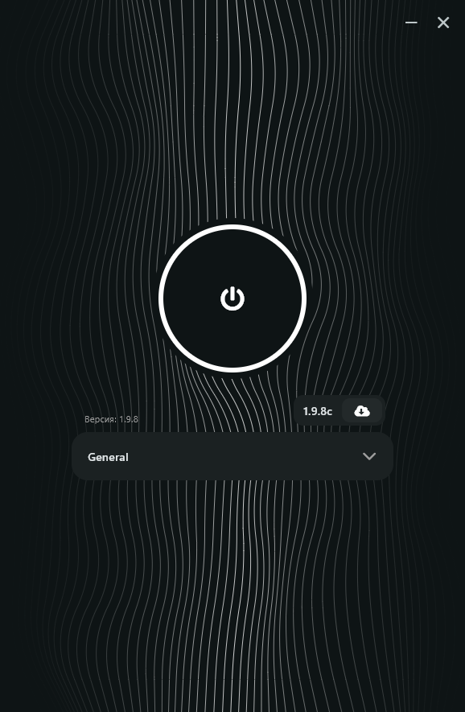

# Zapret UI


Графический интерфейс для [zapret-discord-youtube](https://github.com/Flowseal/zapret-discord-youtube) – утилиты обхода DPI блокировок.

[](https://github.com/skosyrskyv/zapret-discord-youtube-ui/releases/download/0.1.0/zapret-ui-0.1.0.zip)




## Описание

**Zapret UI** – это простая программа с кнопкой, которая позволяет управлять обходом блокировок без необходимости вводить команды в консоль. Интерфейс предоставляет базовые функции:

- Включение / выключение обхода DPI
- Выбор стратегии обхода
- Установка и обновление компонентов `zapret-discord-youtube`

> ⚠️ **Для тонкой настройки и решении проблем** (Добавление адресов прочих ресурсов, параметры фильтрации и т.д.) обратитесь к [README оригинального репозитория](https://github.com/flowseal/zapret-discord-youtube).

## Возможности

- ✅ Управление обходом в один клик
- ✅ Установка и обновление движка `zapret-discord-youtube` без необходимости каждый раз лазить в GitHub
- ✅ Сохранение состояния обхода после перезагрузки компьютера  
  (если обход был включён при выключении ПК, он автоматически включится снова)

В разработке:
- ❌ Редактирование списка хостов
- ❌ Включение/отключение фильтров
- ❌ Автоматическая проверка стратегий на работоспособность

## Установка

1. **Скачайте последнюю версию**  
   [📥 Скачать zip-архив](https://github.com/skosyrskyv/zapret-discord-youtube-ui/releases/download/0.1.0/zapret-ui-0.1.0.zip)

2. **Распакуйте** архив в любую удобную папку

3. **Запустите `zapret-ui.exe`**  
   > 🔑 **Рекомендуется запускать от имени администратора** (обход DPI требует повышенных прав). Программа может работать и без этого, но для надёжности используйте правый клик → «Запуск от имени администратора».


## Использование

1. **Установка / Обновление** – нажмите соответствующую кнопку. Программа скачает актуальную версию `zapret-discord-youtube` и разместит её в папке `%LocalAppData%\zapret_ui\`.

2. Выберете стратегию обхода.
    >⚠️ Какую конкретно выбирать зависит от вашего провайдера интернета. Никто точно не знает какая именно будет работать у вас. Пробуйте все подряд.

3. **Включение обхода** – нажмите большую кнопку по центру экрана;<br>
   **Выключение** – нажмите ее еще раз :)

 **Перезагрузка компьютера** – настройка запоминается: если обход был включён, после перезагрузки он стартует автоматически - запускать заново не нужно.

## Удаление

1. Удалите папку с программой.
2. Удалите загруженные файлы. Найти их можно прочитав следующий раздел.

## Где хранятся скаченные файлы?

Все компоненты `zapret-discord-youtube` (исполняемые файлы, конфигурации, скрипты) скачиваются в папку:

```
C:\Users\{Имя Пользователя}\AppData\Local\zapret_ui
```

## Требования

- Windows 10 / 11 (возможно, работает и на более старых версиях, но не тестировалось)
- Права администратора (рекомендуется)

## Известные ограничения

- Интерфейс не предоставляет доступа к расширенным настройкам `zapret-discord-youtube` – для них используйте оригинальный проект.
- Удаление программы происходит простым удалением папки (не требует деинсталлятора).


**Связанные проекты**  
- [zapret-discord-youtube](https://github.com/flowseal/zapret-discord-youtube)
